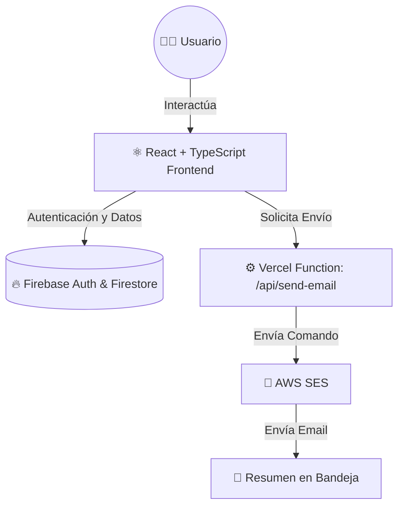

# MateCode Tasks

Aplicación web SPA de gestión de tareas desarrollada para pequeñas empresas. Permite a cada usuario organizar sus actividades diarias, guardarlas en la nube y recibir un resumen por correo electrónico.

## Demo

- Aplicación publicada: [MateCode Tasks](https://matecode-tasks-iota.vercel.app)

## ✨ Características principales

- 🔐 **Autenticación Segura**: Registro e inicio de sesión de usuarios con correo electrónico y contraseña.
- 🛡️ **Rutas Privadas**: Solo los usuarios autenticados pueden acceder a su tablero de tareas.
- 📝 **Gestión Completa**: Creación de tareas con título y descripción. Edición y eliminación.
- ☁️ **Persistencia en la Nube**: Guardado en tiempo real en Cloud Firestore (Firebase).
- 🔄 **Sincronización Inmediata**: Los cambios en el estado de las tareas se reflejan en tiempo real.
- 📧 **Resúmenes por Email**: Envío de un resumen de tareas (pendientes y completadas) usando **AWS SES**.
- 📱 **Interfaz Responsive**: Diseño adaptativo para múltiples dispositivos con estados de carga.
- 🧪 **Testing Garantizado**: Pruebas de componentes con Vitest y React Testing Library.

## 🛠️ Tecnologías utilizadas

| Frontend | Backend & Servicios | Testing |
|----------|---------------------|---------|
| ⚛️ React | 🔥 Firebase Auth | ⚡ Vitest |
| 📘 TypeScript | 🗄️ Cloud Firestore | 🐙 Testing Library |
| ⚡ Vite | 📧 AWS SES | 🌐 JSDOM |
| 🛣️ React Router | ⚙️ Vercel Functions | |
| 🎨 CSS | ▲ Vercel | |

## 🏗️ Arquitectura

La aplicación separa las responsabilidades entre el frontend y el backend utilizando funciones Serverless.



## ⚙️ Variables de entorno 

Crea un archivo `.env` en la raíz del proyecto basándote en `.env.example` y agrega tus credenciales:

```env
# Configuración de Firebase
VITE_FIREBASE_API_KEY=tu_api_key
VITE_FIREBASE_AUTH_DOMAIN=tu_auth_domain
VITE_FIREBASE_PROJECT_ID=tu_project_id
VITE_FIREBASE_STORAGE_BUCKET=tu_storage_bucket
VITE_FIREBASE_MESSAGING_SENDER_ID=tu_messaging_sender_id
VITE_FIREBASE_APP_ID=tu_app_id

# Configuración de AWS SES para el envío de correos
AWS_REGION=us-east-1
AWS_ACCESS_KEY_ID=tu_aws_access_key
AWS_SECRET_ACCESS_KEY=tu_aws_secret_key
SES_FROM_EMAIL=tu_correo_verificado@dominio.com
```

## 🚀 Instalación y uso local

1. **Instala las dependencias:**
   ```bash
   npm install
   ```

2. **Inicia el proyecto en desarrollo:**
   ```bash
   npm run dev
   ```
   *(Nota: Para probar la función de envío de correos localmente, utiliza `npx vercel dev` en lugar de Vite).*

3. **Crea el build de producción:**
   ```bash
   npm run build
   ```

4. **Ejecuta el linter:**
   ```bash
   npm run lint
   ```

## 🧪 Testing

Ejecutar todos los tests:
```bash
npm run test:run
```

Ejecutar Vitest en modo interactivo:
```bash
npm run test
```

### 📋 Tests implementados
- `TaskForm.test.tsx`: Verifica que el formulario envíe correctamente el título y la descripción de una tarea.
- `TaskList.test.tsx`: Verifica que la lista renderice las tareas recibidas y muestre su estado.

## 📁 Estructura del proyecto

```text
matecode-tasks
├── api/                # Funciones Serverless de Vercel
│   └── send-email.ts
├── src/
│   ├── components/     # Componentes de UI modulares
│   ├── config/         # Configuraciones globales (ej. Firebase)
│   ├── context/        # Contextos de React
│   ├── hooks/          # Custom hooks
│   ├── pages/          # Vistas principales de la aplicación
│   ├── services/       # Lógica de conexión a BD y Auth
│   ├── styles/         # Hojas de estilo globales
│   ├── test/           # Configuración de tests
│   └── types/          # Definiciones de tipos de TypeScript
├── .env.example
├── package.json
└── vite.config.ts
```

## 🌐 Deploy

La aplicación se encuentra desplegada de forma automatizada en **Vercel**.

> ⚠️ **Nota para producción**: Para que Firebase Authentication funcione en producción, debes agregar el dominio que te proporcione Vercel en:  
> `Firebase Console → Authentication → Configuración → Dominios autorizados`

## 🤖 Uso de inteligencia artificial

La IA fue utilizada como apoyo durante el desarrollo del proyecto para comprender conceptos, revisar código, resolver errores y documentar decisiones técnicas.

**Ejemplos de prompts utilizados:**
- *"Explícame cómo implementar una función segura de Vercel para enviar emails con AWS SES sin exponer claves en React."*
- *"Revisa este componente React con TypeScript y explícame los errores encontrados."*
- *"Guíame paso a paso para conectar Firebase Authentication con rutas protegidas."*

> La IA fue utilizada como herramienta de apoyo didáctico. Todo el código fue revisado, adaptado y comprendido exhaustivamente antes de incorporarse al proyecto final.
